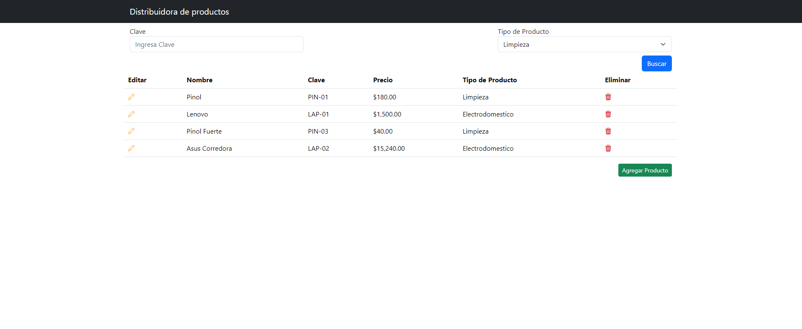
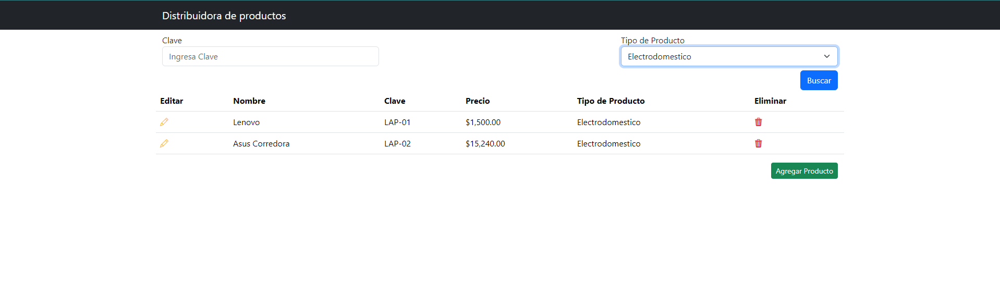
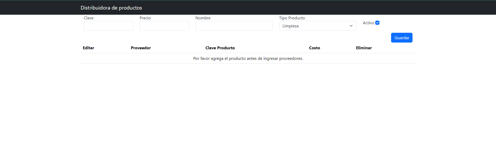
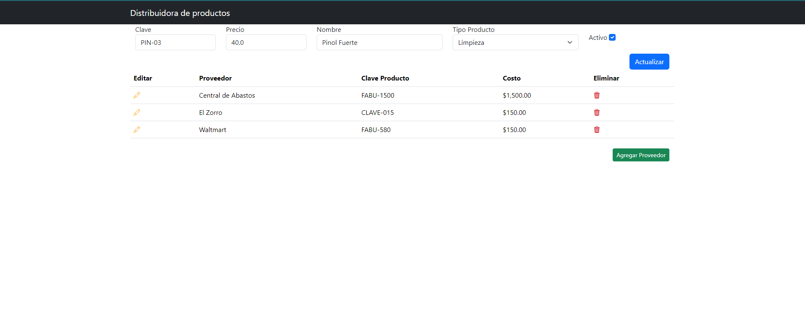
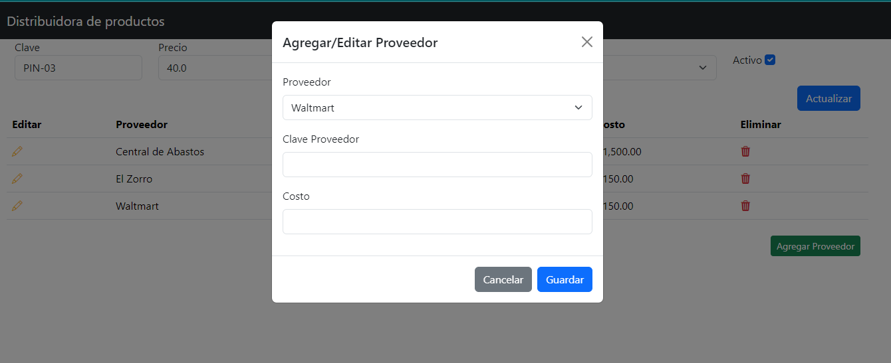
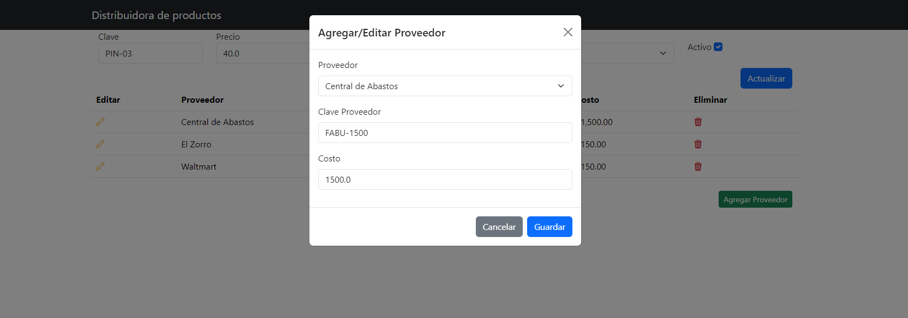
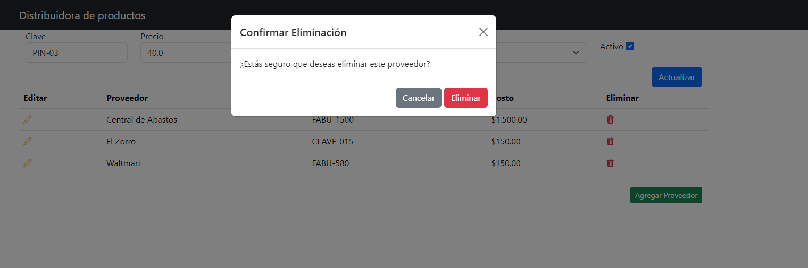

# Proyecto Distruibuidora

Breve sistema de administración de productos y sus proveedores.

## Requisitos

Antes de comenzar, asegúrate de tener lo siguiente instalado en tu máquina:

- **Java Development Kit (JDK)** 17.
- **Maven** (versión 3.6.3 o superior)
- **Git** para clonar el repositorio.

## Instalación

### 1. Clonar el repositorio

```bash
git clone https://github.com/DanielCruzChavarria/distribuidora.git
cd distribuidora
```

### 2. Configuración de Springboot

```bash
spring.jpa.hibernate.ddl-auto=update
spring.jpa.show-sql=true
server.port=8080
spring.mvc.throw-exception-if-no-handler-found=true
spring.web.resources.add-mappings=false
```

### 3. Construir el proyecto

Ejecuta el siguientes comando para construir el proyecto y descargar las dependencias necesarias:

**Maven:**

```bash
mvn clean install
```

### 4. Configuración de la base de datos


1. Crear una base de datos:

    ```sql
    CREATE DATABASE inventario_bd;
    ```

2. Configurar las propiedades de conexión en `src/main/resources/application.properties`:

   Se incluye un script de muestra para correr la base de datos con algunos datos precargados.

    ```properties
    spring.datasource.url=jdbc:mysql://localhost:3306/inventario_bd
    spring.datasource.username=tu_usuario
    spring.datasource.password=tu_contraseña
    ```

### 5. Ejecutar la aplicación

Para ejecutar la aplicación localmente, puedes usar uno de los siguientes comandos:

**Maven:**

```bash
mvn spring-boot:run
```

### 6. Acceso a la aplicación

Una vez que la aplicación esté en ejecución, debería estar disponible en `http://localhost:8080` (a menos que hayas configurado otro puerto).


## Screenshots

### Lista de productos


### Filtrado


## Nuevo producto


## Edición de producto


## Nuevo Proveedor de producto


## Edición de proveedor


## Eliminación de proveedor
